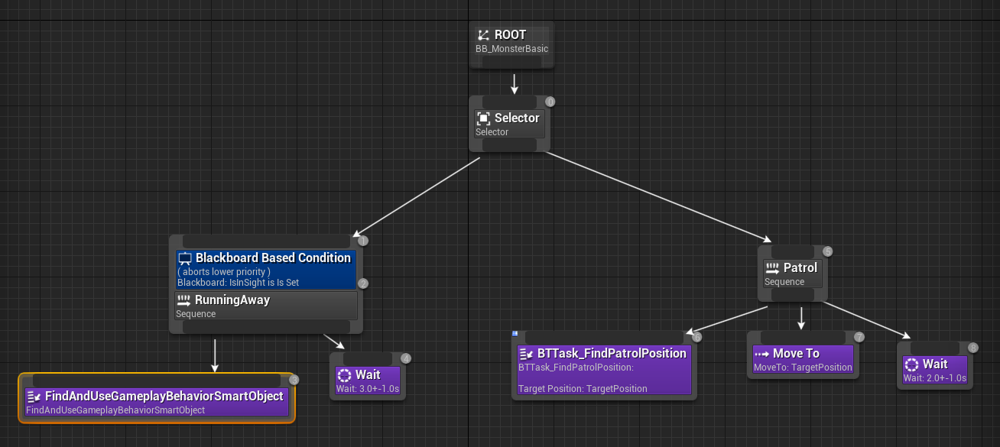
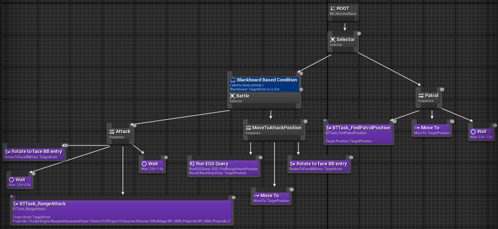
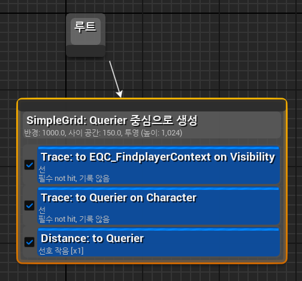
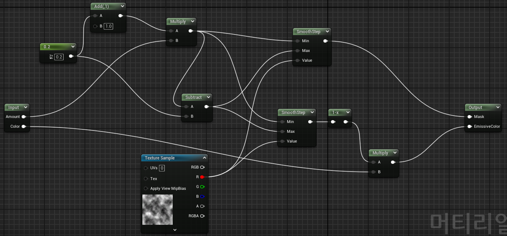

# 언리얼 5.3의 전투 게임 기능에 대한 설명 ( 1인 개발 )

## 기능명 : 정찰병 AI 
### 기능 설명
이 AI는 기본적으로 순찰(Patrol) 상태이며, 플레이어를 탐지하면 즉시 행동을 전환해 엄폐물로 도망치는 행동을 수행합니다. 
이 기능은 비헤이비어 트리(Behavior Tree)를 통해 구현되었습니다.


[Combat-Centric Game of Unreal 5.3: XBot AI](https://www.youtube.com/watch?v=RkRz2BjRmJM)


### 핵심 코드 1: 정찰병 AI 비헤이비어 트리



- 초기 구현은 단순한 유한 상태 머신(FSM)을 이용했지만, 상태 전환 및 확장이 어려웠습니다. 
이를 보완하기 위해 비헤이비어 트리를 사용했습니다. 비헤이비어 트리는 상태를 유연하게 제어할 수 있도록 
다양한 노드(Sequence, Selector 등)를 제공하여 복잡한 AI 동작을 보다 자연스럽게 구현할 수 있게 해줍니다.

- 순찰(Patrol) 동작은 GetRandomReachablePointInRadius 노드를 사용해 AI가 탐색 가능한 
영역 내에서 무작위 위치를 찾고, 그 위치로 이동하도록 구현했습니다.

- 도망치는 행동은 언리얼 엔진의 Smart Object 시스템을 이용하여 AI가 엄폐물을 자동으로 
탐지하고 이동하게 했습니다. Blackboard 데코레이터를 통해 AI가 플레이어를 감지할 경우 
엄폐물로 도망치는 동작을 트리거합니다.


## 기능명 : 마법 전투병 AI 
### 기능 설명
이 AI는 플레이어를 탐지하지 못하면 순찰(Patrol) 상태에 있지만, 플레이어를 
발견하면 원거리 공격을 위해 대기하는 동작으로 전환합니다. 만약 대기하는 동안 
플레이어가 엄폐하면, AI는 적절한 사격 위치를 찾아 이동합니다. 
이 역시 비헤이비어 트리를 통해 구현되었습니다.


[Combat-Centric Game of Unreal 5.3: XBot Mage AI](https://www.youtube.com/watch?v=vADQb_kspTE)


### 핵심 코드 1: 마법 전투병 AI 비헤이비어 트리와 인바이런먼트 쿼리




- AI가 플레이어를 조준하기 위해 이동하는 과정에서 인바이런먼트 쿼리 시스템(EQS)을 활용해 최적의 사격 위치를 찾습니다. EQS의 Grid 노드, Trace, Distance 테스트를 통해 플레이어를 공격할 수 있는 유리한 위치를 탐색하고, 이를 통해 AI의 전략적 이동을 구현했습니다. 이 방식으로 AI는 단순히 플레이어를 추적하는 것이 아닌, 공격의 효율성을 극대화할 수 있는 위치로 이동하도록 설정되었습니다.


## 기능명 : AI와 플레이어의 공격과 피격
### 기능 설명
이 기능은 언리얼 엔진의 Gameplay Ability System(GAS)을 이용해 AI와 플레이어 간의 공격 및 피격을 처리합니다. 이 시스템을 통해 공격과 방어에 필요한 속성을 설정하고, 능력 및 효과가 타겟에 정확히 적용되도록 했습니다.


[Combat-Centric Game of Unreal 5.3: Attack & Damage](https://www.youtube.com/watch?v=rXJIfTRE2R0)


### 핵심 코드 1: 속성 변화
```cpp
if (Data.EvaluatedData.Attribute == Get_healthAttribute())
{
    Set_health(FMath::Clamp(Get_health(), 0.f, Get_maxHealth()));

    if (HPChanged.IsBound())
    {
        HPChanged.Broadcast(Get_health() / Get_maxHealth());
    }
}
else if (Data.EvaluatedData.Attribute == Get_staminaAttribute())
{
    Set_stamina(FMath::Clamp(Get_stamina(), 0.f, Get_maxStamina()));
}
```
- 프로그래밍을 하다 보면 공통적인 요소를 찾아 재사용성을 극대화하는 것이 얼마나 
중요한지 자주 느끼게 됩니다. 
특히, 유지보수나 확장성을 고려할 때 이런 공통점들을 제대로 파악하고 구조화하는 것이 
성공적인 시스템 구축의 핵심이라는 것을 깨닫게 되었습니다.
이런 면에서 언리얼 엔진의 Game Play Ability System을 접했을 때 큰 배움을 얻었습니다. 
이 시스템은 다양한 장르에서 필수적인 기능들을 능력(Ability), 효과(Effect), 능력치(Attribute)라는 
세 가지 핵심 개념으로 아주 깔끔하게 묶어 제공하고 있는데, 이러한 부분을 통해 어떻게 하면 
다양한 장르의 게임에서 재사용 가능한 시스템을 만들 수 있는지에 대해 많은 생각을 하게 되었습니다.

- Gameplay Effect를 사용하여 AI 또는 플레이어에게 가해지는 공격을 구현했습니다.  
GAS에서 제공하는 UAttributeSet의 PostGameplayEffectExecute 함수를 통해 해당 효과가 실행된 후 속성 변화를 처리하고, 
변화된 속성이 최댓값을 넘지 않도록 했습니다.  
체력, 스태미너 등의 속성이 변경될 때, UI에 실시간으로 반영되도록 이벤트를 발생시켜 시각적인 피드백을 제공했습니다.

### 핵심 코드 2: 속성 관리와 데미지 계산
```cpp

DEFINE_ATTRIBUTE_CAPTUREDEF(UBaseCharacterStatus, _attackPoint, Source, false);
DEFINE_ATTRIBUTE_CAPTUREDEF(UBaseCharacterStatus, _defencePoint, Target, false);
DEFINE_ATTRIBUTE_CAPTUREDEF(UBaseCharacterStatus, _health, Target, false);

```
```cpp

float dp = 0.f;
ExecutionParams.AttemptCalculateCapturedAttributeMagnitude(DStatics()._defencePointDef, evaluationParam, dp);

float ap = 0.f;
ExecutionParams.AttemptCalculateCapturedAttributeMagnitude(DStatics()._attackPointDef, evaluationParam, ap);

float damageRate = spec.GetSetByCallerMagnitude(FGameplayTag::RequestGameplayTag(FName("Attack.DamageRate")), false, 1.f);

float calculateDamage = (ap - dp) * damageRate;

if (calculateDamage > 0)
{
     OutExecutionOutput.AddOutputModifier(FGameplayModifierEvaluatedData(DStatics()._healthProperty, EGameplayModOp::Additive, -calculateDamage));
}

```
- 공격자의 게임플레이 능력(Ability)에 의해 Gameplay Effect가 타겟(방어자)에게 적용될 때 
UGameplayEffectExecutionCalculation의 Execute_Implementation 함수가 호출된다는 점을 활용했습니다. 

- 데미지 계산은 공격자의 공격력과 방어자의 방어력의 차이로 결정되며, "Attack.DamageRate" 값에 따라 데미지가 조정됩니다. 예를 들어, DamageRate가 1.5일 경우 최종 데미지가 50% 증가하여 적용되고, 0.5일 경우 최종 데미지가 절반으로 감소합니다. 또한, 공격력이 방어력보다 클 경우에만 데미지가 발생하며, 반대로 방어력이 더 높으면 데미지가 0으로 무효화됩니다.


## 기능명 : AI 소멸
### 기능 설명
이 기능은 AI 캐릭터가 체력이 0이 되었을 때 디졸브 효과를 사용하여 자연스럽게 사라지게 만드는 기능입니다. 


[Combat-Centric Game of Unreal 5.3: Dissolve Effect](https://www.youtube.com/watch?v=WAVaeNaUJAk)

### 핵심 코드 1: 디졸브 효과



- 0과 1 사이의 랜덤 값을 가지는 노이즈를 사용하여 시간이 지남에 따라 특정 임계값 이상의 픽셀들이 점진적으로 사라지도록 합니다. 여기서 값이 1에 가까운 픽셀은 먼저 사라지고, 0에 가까운 픽셀은 나중에 사라지게 됩니다. 임계값 근처에 위치한 픽셀들은 '사라지는 경계'로 간주되며, 이 경계의 범위를 설정하면 해당 범위 내에 있는 픽셀에 색상을 부여하여 사라지기 직전의 구간을 시각적으로 강조할 수 있습니다. 경계 범위가 클수록 사라진 영역의 테두리가 두껍게 표현되며, 범위가 작을수록 더 섬세하고 얇은 테두리가 형성됩니다. 이를 통해 픽셀이 사라지는 과정에서 명확한 시각적 구분선을 만들 수 있습니다.
